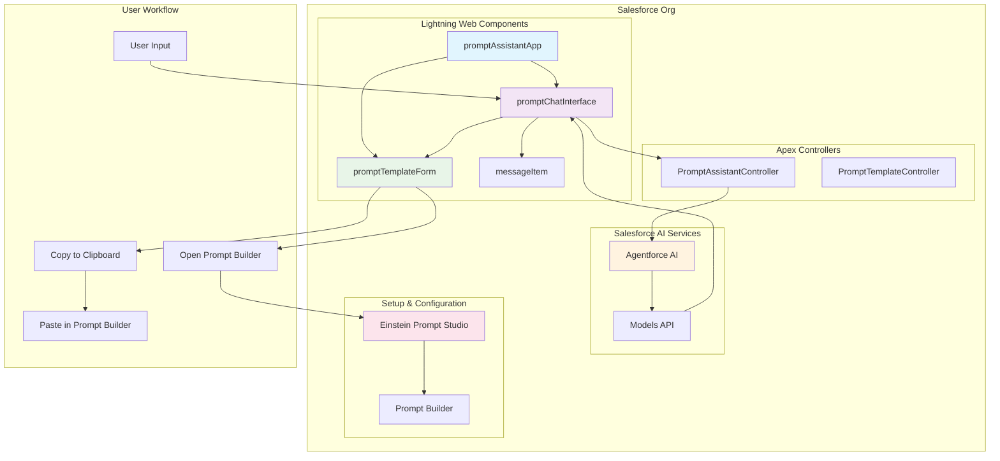

# Prompt Assistant - Agentforce-Powered LWC App

A modern, professional Lightning Web Component (LWC) application that provides an intelligent chat interface for generating effective prompt templates for Salesforce Prompt Builder. Built with native Agentforce AI capabilities and featuring a polished, avatar-enhanced user experience with seamless Prompt Builder integration.

## 🚀 **What This App Does**

### **Core Functionality**
- **AI-Powered Chat Interface**: ChatGPT-style conversation with Agentforce AI
- **Smart Prompt Generation**: Creates professional prompt templates for any Salesforce use case
- **Copy & Paste Integration**: Seamlessly copy templates to Salesforce Prompt Builder
- **Native Salesforce Integration**: Uses built-in Models API, no external dependencies

### **Key Features**
- **Modern Chat UI**: Clean, responsive interface with distinct user/assistant messaging
- **Avatar System**: Visual distinction between user (blue) and assistant (purple) messages
- **Smart Suggestions**: Clickable prompt templates that populate the input box
- **Real-time Generation**: Instant AI-powered prompt creation
- **Copy & Paste Workflow**: One-click copy to clipboard with Prompt Builder integration
- **Professional Styling**: SLDS2 compliant with custom enhancements

## 🎨 **User Experience Features**

### **Chat Interface**
- **User Messages**: Light blue bubbles with user avatars, right-aligned
- **Assistant Messages**: White bubbles with robot avatars, left-aligned
- **Timestamps**: Right-aligned on same line as usernames
- **Responsive Design**: Works seamlessly on all devices

### **Avatar System**
- **User Avatar**: Blue circular avatar with white user icon (28px)
- **Assistant Avatar**: Purple circular avatar with white robot icon (28px)
- **Professional Appearance**: Clean, contained design with subtle shadows
- **Visual Hierarchy**: Clear distinction between message types

### **Smart Suggestions**
- **Welcome Message**: Four clickable prompt templates
- **One-Click Population**: Click any suggestion to fill the input box
- **Customizable**: Easy to modify suggestion text
- **Professional Templates**: Pre-built for common Salesforce scenarios

### **Loading States**
- **Inline Loading**: "Generating your prompt..." appears in conversation flow
- **No Overlays**: Clean, non-intrusive loading experience
- **Visual Feedback**: Animated dots and status updates
- **User-Friendly**: Maintains conversation context during generation

### **Prompt Builder Integration**
- **Copy Template**: One-click copy of formatted prompt content to clipboard
- **Open Prompt Builder**: Direct link to Einstein Prompt Studio in Setup
- **Formatted Output**: Includes template name, description, content, and variables
- **Step-by-Step Instructions**: Built-in guidance for creating templates in Prompt Builder
- **No API Dependencies**: Reliable copy/paste workflow without complex integrations

## 🏗️ **Technical Architecture**

### **Component Structure**
```
force-app/main/default/lwc/
├── promptAssistantApp/           # Main app container
│   ├── promptAssistantApp.html   # App layout and footer
│   ├── promptAssistantApp.js     # App logic and state
│   └── promptAssistantApp.css    # App styling
├── promptChatInterface/          # Chat interface
│   ├── promptChatInterface.html  # Chat layout and input
│   ├── promptChatInterface.js    # Chat logic and AI integration
│   └── promptChatInterface.css   # Chat styling
├── messageItem/                  # Individual message component
│   ├── messageItem.html          # Message layout and avatars
│   ├── messageItem.js            # Message logic and events
│   └── messageItem.css           # Message styling and avatars
└── promptTemplateForm/           # Template management
    ├── promptTemplateForm.html   # Form layout
    ├── promptTemplateForm.js     # Form logic
    └── promptTemplateForm.css    # Form styling
```

### **System Architecture**


### **Technology Stack**
- **Lightning Web Components**: Modern Salesforce component framework
- **Salesforce Models API**: Native AI integration via Apex
- **SLDS2 Design System**: Professional Salesforce styling
- **Responsive CSS**: Mobile-first design approach
- **Event-Driven Architecture**: Clean component communication

## 🔧 **Installation & Setup**

### **Prerequisites**
- Salesforce org with API version 64.0+
- Access to Lightning Web Components
- Basic Salesforce development environment

### **Quick Setup**
1. **Clone Repository**
   ```bash
   git clone <repository-url>
   cd promptAssistant
   ```

2. **Deploy to Org**
   ```bash
   sf project deploy start
   ```

3. **Enable Tab**
   - Navigate to Setup > Tabs
   - Find "Prompt Assistant" tab
   - Set "Default On" for desired profiles
   - Add to App Launcher if desired

4. **Access the App**
   - Use the Prompt Assistant tab
   - Or navigate via App Launcher
   - Start chatting with the AI assistant

## 💡 **How to Use**

### **Getting Started**
1. **Open the App**: Navigate to the Prompt Assistant tab
2. **Welcome Message**: See the four suggestion buttons
3. **Click a Suggestion**: Or type your own prompt request
4. **Generate Prompt**: Click "Generate Prompt" button
5. **Review & Copy**: Use the "Copy Template" button to copy to clipboard
6. **Open Prompt Builder**: Click "Open Prompt Builder" to go to Setup
7. **Create Template**: Paste the content and create your prompt template

### **Suggestion Templates**
- **"Create a sales email prompt"** - Sales outreach templates
- **"Generate a case wrap-up prompt"** - Customer service summaries
- **"Build a campaign promo prompt"** - Marketing campaign content
- **"Design a call transcript analysis prompt"** - Call center insights

### **Custom Prompts**
- **Describe your need** in natural language
- **Specify the context** (sales, service, marketing, etc.)
- **Include details** about your target audience
- **Mention any specific** Salesforce objects or processes

## 🎯 **Use Cases**

### **Sales Teams**
- Lead qualification prompts
- Sales email templates
- Follow-up sequences
- Proposal generation

### **Customer Service**
- Case resolution prompts
- Customer communication templates
- Knowledge base articles
- Service summaries

### **Marketing Teams**
- Campaign messaging
- Social media content
- Email marketing templates
- Lead nurturing sequences

### **Administrators**
- Data analysis prompts
- Process documentation
- Training materials
- System explanations

## 🔮 **Future Enhancements**

### **Implemented Features**
- ✅ **Copy & Paste Integration**: Direct integration with Prompt Builder via clipboard
- ✅ **Template Categories**: Organized by business function (Sales, Service, Marketing, etc.)
- ✅ **Formatted Export**: Structured template output with variables and instructions
- ✅ **One-Click Setup Access**: Direct link to Einstein Prompt Studio

### **Planned Features**
- **Template Library**: Save and share custom prompts
- **Analytics**: Usage tracking and prompt effectiveness
- **Multi-language Support**: International prompt generation
- **Batch Processing**: Generate multiple templates at once

### **Integration Roadmap**
- **Flow Builder**: Direct prompt integration
- **Process Builder**: Automated prompt workflows
- **Einstein GPT**: Enhanced AI capabilities
- **External Systems**: API access for other platforms

## 🎨 **Design Philosophy**

### **User Experience**
- **Intuitive Interface**: Easy to use, professional appearance
- **Visual Hierarchy**: Clear distinction between elements
- **Responsive Design**: Works on all devices and screen sizes
- **Accessibility**: Follows Salesforce accessibility guidelines

### **Professional Appearance**
- **Clean Layout**: Minimal clutter, maximum functionality
- **Consistent Styling**: Unified design language throughout
- **Modern Aesthetics**: Contemporary Salesforce design patterns
- **Brand Consistency**: Integrates seamlessly with org branding

## 📞 **Support & Feedback**

### **Documentation**
- [Salesforce LWC Developer Guide](https://developer.salesforce.com/docs/component-library/documentation/en/lwc)
- [SLDS2 Design System](https://www.lightningdesignsystem.com/)
- [Salesforce Models API](https://developer.salesforce.com/docs/atlas.en-us.apexref.meta/apexref/apex_ai_models.htm)

### **Getting Help**
- Check the component code for implementation details
- Review Salesforce LWC best practices
- Consult Salesforce developer documentation
- Reach out to the development team

---

**Built with ❤️ for the Salesforce community**

*This app demonstrates modern LWC development practices, professional UI/UX design, and seamless integration with Salesforce's native AI capabilities through Agentforce.*
