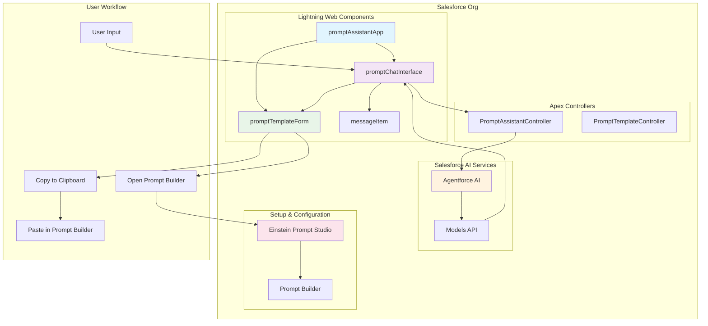

# Prompt Assistant - Built by a Salesforce SE for SEs

Hey there! I'm Dylan, a Solution Engineer at Salesforce. I built this Lightning Web Component (LWC) app to help my fellow SEs (or anyone really) quickly create effective prompt templates for demos, POCs, and customer implementations. 

As SEs, we're constantly asked to show off Prompt Builder capabilities, but creating good prompt templates from scratch takes time we don't always have. This app uses Agentforce AI to generate professional prompt templates that you can copy directly into Prompt Builder - no complex setup required.

## 🚀 **Why I Built This**

### **The SE Problem**
- **Demo Pressure**: Customers want to see Prompt Builder in action, but building templates takes forever
- **Template Quality**: Generic templates don't showcase the real power of Agentforce
- **Time Constraints**: We need to focus on the business value, not template syntax
- **Consistency**: Every SE should have access to high-quality, tested templates

### **The Solution**
- **AI-Powered Generation**: Describe what you need in plain English, get a professional template
- **SE-Tested Templates**: Built with real customer scenarios in mind
- **Copy & Paste Ready**: No complex deployment - just copy to Prompt Builder and go
- **Demo-Ready**: Templates that actually impress customers and show real business value

### **Key Features**
- **Modern Chat UI**: Clean, responsive interface with distinct user/assistant messaging
- **Smart Suggestions**: Clickable prompt templates that populate the input box
- **Real-time Generation**: Instant AI-powered prompt creation
- **Copy & Paste Workflow**: One-click copy to clipboard with Prompt Builder integration
- **SLDS2 Compliance**: SLDS2 compliant!

## 🏗️ **Technical Architecture**

### **Component Structure**
```
force-app/main/default/lwc/
├── promptAssistantApp/           # Main app container
│   ├── promptAssistantApp.html   # App layout and footer
│   ├── promptAssistantApp.js     # App logic and state
│   └── promptAssistantApp.css    # App styling
├── promptChatInterface/          # Chat interface
│   ├── promptChatInterface.html  # Chat layout and input
│   ├── promptChatInterface.js    # Chat logic and AI integration
│   └── promptChatInterface.css   # Chat styling
├── messageItem/                  # Individual message component
│   ├── messageItem.html          # Message layout and avatars
│   ├── messageItem.js            # Message logic and events
│   └── messageItem.css           # Message styling and avatars
└── promptTemplateForm/           # Template management
    ├── promptTemplateForm.html   # Form layout
    ├── promptTemplateForm.js     # Form logic
    └── promptTemplateForm.css    # Form styling
```

### **System Architecture**


## 🔧 **Installation & Setup**

### **Prerequisites**
- Salesforce org with API version 64.0+
- Access to Lightning Web Components
- Basic Salesforce development environment

### **Quick Setup**
1. **Clone Repository**
   ```bash
   git clone <repository-url>
   cd promptAssistant
   ```

2. **Deploy to Org**
   ```bash
   sf project deploy start
   ```

3. **Enable Tab**
   - Navigate to Setup > Tabs
   - Find "Prompt Assistant" tab
   - Set "Default On" for desired profiles
   - Add to App Launcher if desired

4. **Access the App**
   - Use the Prompt Assistant tab
   - Or navigate via App Launcher
   - Start chatting with the AI assistant

## 💡 **How to Use**

### **Getting Started**
1. **Open the App**: Navigate to the Prompt Assistant tab
2. **Welcome Message**: See the four suggestion buttons
3. **Click a Suggestion**: Or type your own prompt request
4. **Generate Prompt**: Click "Generate Prompt" button
5. **Review & Copy**: Use the "Copy Template" button to copy to clipboard
6. **Open Prompt Builder**: Click "Open Prompt Builder" to go to Setup
7. **Create Template**: Paste the content and create your prompt template

### **Suggestion Templates**
- **"Create a sales email prompt"** - Sales outreach templates
- **"Generate a case wrap-up prompt"** - Customer service summaries
- **"Build a campaign promo prompt"** - Marketing campaign content
- **"Design a call transcript analysis prompt"** - Call center insights

### **Custom Prompts**
- **Describe your need** in natural language
- **Specify the context** (sales, service, marketing, etc.)
- **Include details** about your target audience
- **Mention any specific** Salesforce objects or processes

- System explanations

## 🔮 **Future Enhancements**

### **Implemented Features**
- ✅ **Copy & Paste Integration**: Direct integration with Prompt Builder via clipboard
- ✅ **Template Categories**: Organized by business function (Sales, Service, Marketing, etc.)
- ✅ **Formatted Export**: Structured template output with variables and instructions
- ✅ **One-Click Setup Access**: Direct link to Einstein Prompt Studio

### **Planned Features**
- **Template Library**: Save and share custom prompts
- **Analytics**: Usage tracking and prompt effectiveness
- **Multi-language Support**: International prompt generation
- **Batch Processing**: Generate multiple templates at once

### **Integration Roadmap**
- **Flow Builder**: Direct prompt integration
- **External Systems**: API access for other platforms

### **Documentation Used**
- [Salesforce LWC Developer Guide](https://developer.salesforce.com/docs/component-library/documentation/en/lwc)
- [SLDS2 Design System](https://www.lightningdesignsystem.com/)
- [Salesforce Models API](https://developer.salesforce.com/docs/atlas.en-us.apexref.meta/apexref/apex_ai_models.htm)

---

**Built with ❤️ for the Salesforce community**

*This app demonstrates modern LWC development practices, professional UI/UX design, and seamless integration with Salesforce's native AI capabilities through Agentforce.*
